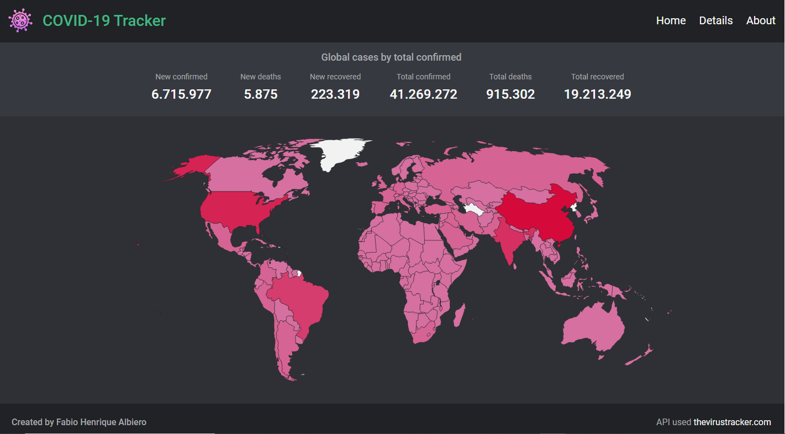
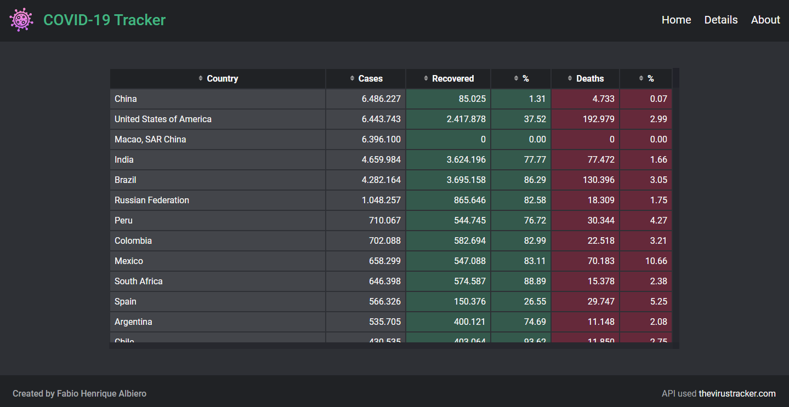

<h1 align="center">Coronavirus tracker<h1>

<h1>  
<h1> 

# Indice
- [About](#-about)
- [Technologies used](#-technologies-used)
- [How to download the project](#-how-to-download-the-project)

---

# About
Project **Corona virus Tracker** is a page developed to share informations about the covid-19 with details consuming Real time APIs and for educational purposes to consolidate programming concepts with **React**, **APIs**, **Context API**


---

## Technologies used 

The project was developed using the following technologies:

- [Javascript](https://www.w3schools.com/js/default.asp)
- [React](https://pt-br.reactjs.org/)
- [Context API](https://reactjs.org/docs/context.html)
- [API](https://api.covid19api.com/)
- [SVGmt](https://hugozap.github.io/react-svgmt/#api)
- [Styled-Components](https://styled-components.com/)
- [HTML](https://www.w3schools.com/html/)
- [CSS](https://www.w3schools.com/css/default.asp)


---

## 📁 How to download the project
```bash

    #Clone repository
    $ git clone https://github.com/coronavirus-tracker

    #Enter the project folder
    cd coronavirus-tracker

    #Install dependencies
    npm install / yarn

    #Execute the application
    npm start / yarn start

```

---
This project is licensed under the MIT | Developed by [Fabio Albiero](http://fabioalbiero.com/)
